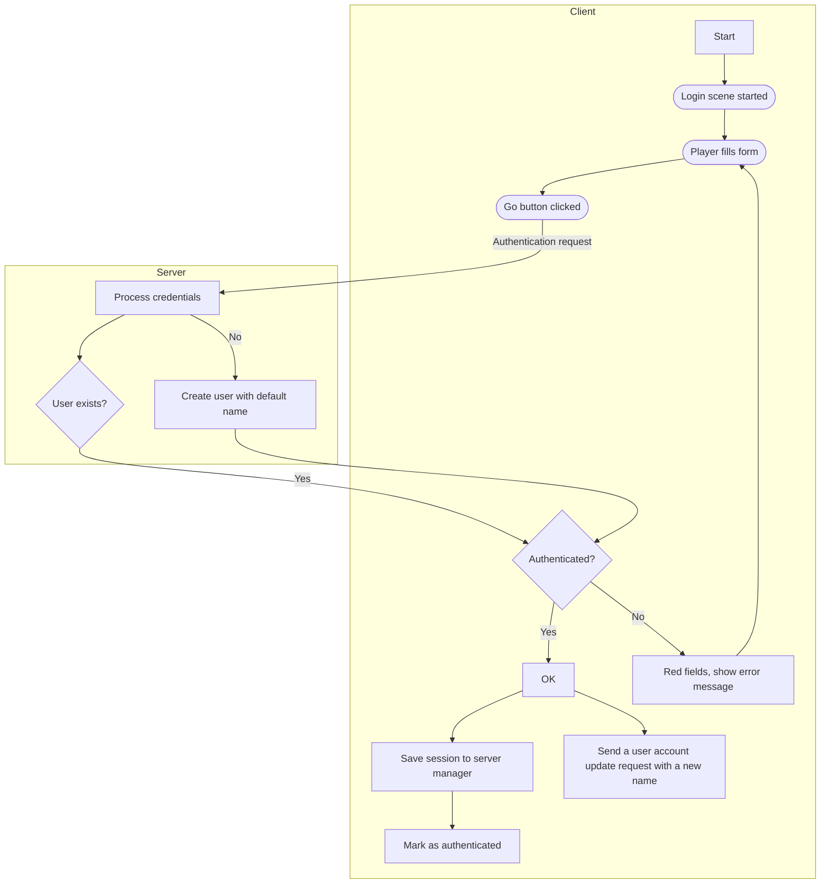
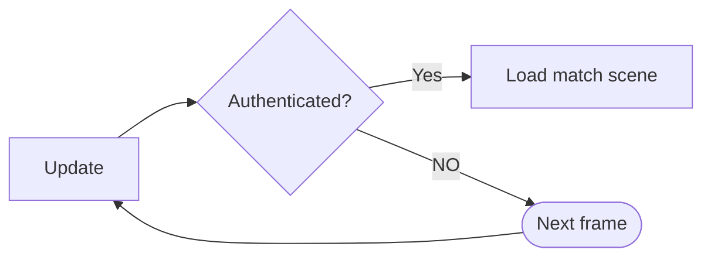

# Authentication

## Architecture

```mermaid
---
title "Authentication flow"
---
flowchart TD
    subgraph Client
        S[Start] --> LS([Login scene started])
        LS --> BT([Player fills form])
        BT --> OC([Go button clicked])
        ARR{Authenticated?}
        ARR --> |Yes| OK
        OK --> OK0[Save session to server manager]
        OK --> OK1[Send a user account update request with a new name]
        OK0 --> OK2[Mark as authenticated]
        ARR --> |No| NOK[Red fields, show error message]
        NOK --> BT
    end
    subgraph Server
        OC --> |Authentication request| C[Process credentials]
        C --> USR{User exists?}
        USR --> |Yes| ARR
        C --> |No| CU[Create user with default name]
        CU --> ARR
    end
```

```mermaid
---
title "Authentication flow"
---
flowchart LR
    Update --> A{Authenticated?}
    N([Next frame]) --> Update
    A --> |Yes| LS[Load match scene]
    A --> |NO| N
```
